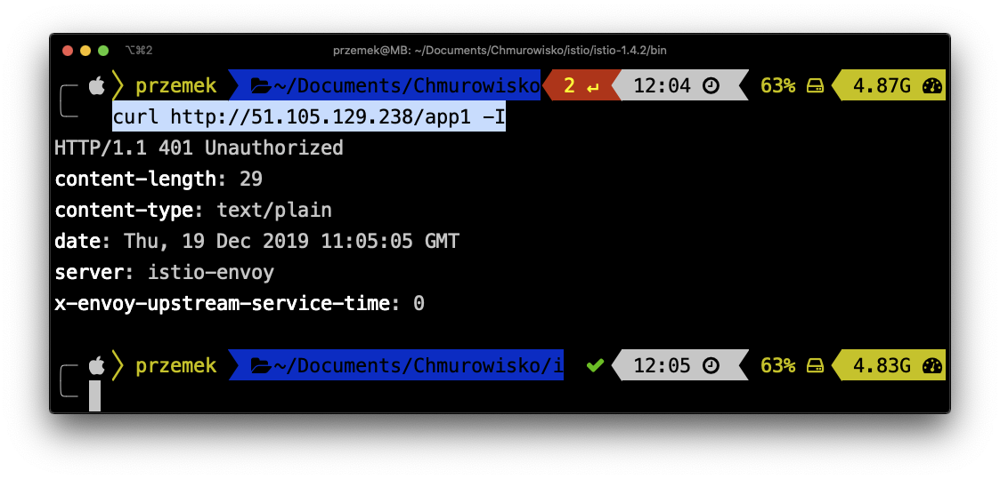
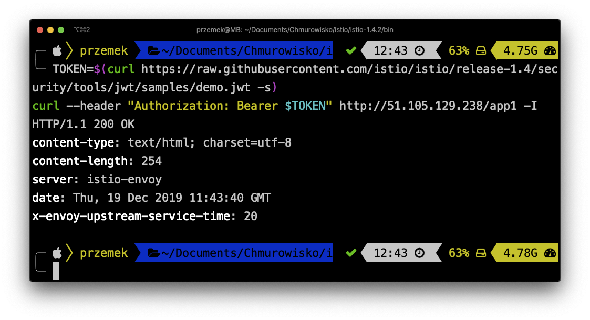

<br><br>
<br><br>
<br><br>

# End User Authentication

## LAB Overview

#### In this lab you will add a JWT authorizer to *app* 1 service


## Task 1: Adding JWT authorizer to *app1* endpoint

1. Download [a manifest file](jwt_policy.yaml) and apply it by executing:
```
kubectl apply -f jwt_policy.yaml
```

Now, when you try opening the web page ``<YOUR-INGRESS-IP>/app1`` you should get an **Origin authentication failed.** error

You can also use *curl* to examine headers:
curl http://<YOUR-INGRESS-IP>/app1 -I


2. since we can't add JWT token to the browser request, try executing following command to add Istio demo token to the request headers:
```
TOKEN=$(curl https://raw.githubusercontent.com/istio/istio/release-1.4/security/tools/jwt/samples/demo.jwt -s)
curl --header "Authorization: Bearer $TOKEN" http://<YOUR-INGRESS-IP>/app1 -I
```


## Task 2: Clean up

1. Remove the policy by executing
```
kubectl delete -f jwt_policy.yaml
```

## END LAB
<br><br>
<center><p>&copy; 2019 Chmurowisko Sp. z o.o.<p></center>
