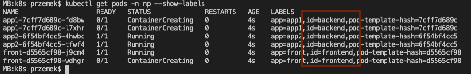

<br><br>
<br><br>
<br><br>

# Network Policies

## LAB Overview

#### In this lab you are going to create diffferent network policies and observe how to traffic is allowed/denied between pods.

## Task 1: Deploying the application

1. Deploy the application
```
kubectl apply -f 1_deployments.yaml
```
2. Find your *service*  address by executing:
```
kubectl get svc -n np
```
3. Check if the pods are running:
```
kubectl get pods -n np --show-labels
```
Please notice, there are two groups of pods: nackend and frontend.


## Task 2: Applying ingress network policies

1. Using second terminal window, run additional test pod by executing:
```
kubectl run curl --image=radial/busyboxplus:curl -i --tty --rm
```
2. Inside the pod check if all the connections work by executing:
* connection to frontend service: ``curl -m 3 front.np``
* connection to backend services: ``curl -m 3 app1.np`` and ``curl -m 3 app2.np``
* connection between frontend and backend pods: ``curl -m 3 front.np/req?url=http://app1.np`` and ``curl -m 3 front.np/req?url=http://app2.np``
3. Exit the container: ``exit``
4.  Close ingress traffic on backend pods by applying network policy:
```
kubectl apply -f 2_ingress_policy.yaml
```
5. Create a test pod again and inside the test pod check connections:
* to frontend service: ``curl -m 3 front.np`` (should be OK)
* connection to backend services: ``curl -m 3 app1.np`` and ``curl -m 3 app2.np``
* connection between frontend and backend pods: ``curl -m 3 front.np/req?url=http://app1.np``
6. Exit the container: ``exit``
7. Allow ingress traffic to backend pods from frontend pods
```
kubectl apply -f 3_allow_ingress_policy.yaml
```
6. Inside the test pod check connections:
* to frontend service: ``curl -m 3 front.np`` (should be OK)
* connection to backend services: ``curl -m 3 app1.np`` and ``curl -m 3 app2.np``
* connection between frontend and backend pods: ``curl -m 3 front.np/req?url=http://app1.np`` and ``curl -m 3 front.np/req?url=http://app2.np`` (should be OK)

## Task 3: Applying egress network policies

1. Close outgoing traffic for frontend pods by aplying egress policy:
```
kubectl apply -f 4_egress_policy.yaml
```
2. Back, inside test pod check the connections:
* between frontend and backend pods ``curl -m 3 front.np/req?url=http://app1.np``

3. Allow egress traffic on frontend pods. Allow then to connect to backend pods:
```
kubectl apply -f 5_allow_egress_policy.yaml
```
4. Back, inside test pod check the connections:
* between frontend and backend pods ``curl -m 3 front.np/req?url=http://app1.np``
5. Does the connection work? Should it?
6. Check ip adresses for your backend pods
```
kubectl get pods -n np -o wide
```
7. Copy the ip address of one of your backend pods and inside the test pod try connecting using that IP address:  
```
curl -m 3 front.np/req?url=http://IP_ADDRESS:8080
```
Now the connection should be possible

## Task 4: Adding DNS as allowed service

1. Configure egress policy by executing:
```
kubectl apply -f 6_dns_egress_policy.yaml
``` 
2. Inside test pod try connecting between frontend and backend pods: ``curl -m 3 front.np/req?url=http://app1.np`` Now the connection should be possible
3. Still in the test pod try connecting to Google from frontend pod: ``curl -m 3 front.np/req?url=http://www.google.com``

## Task 5: Cleanup
1. Delete all resources by executing:
```
kubectl delete ns np
```
## END LAB

<br><br>

<center><p>&copy; 2019 Chmurowisko Sp. z o.o.<p></center>
