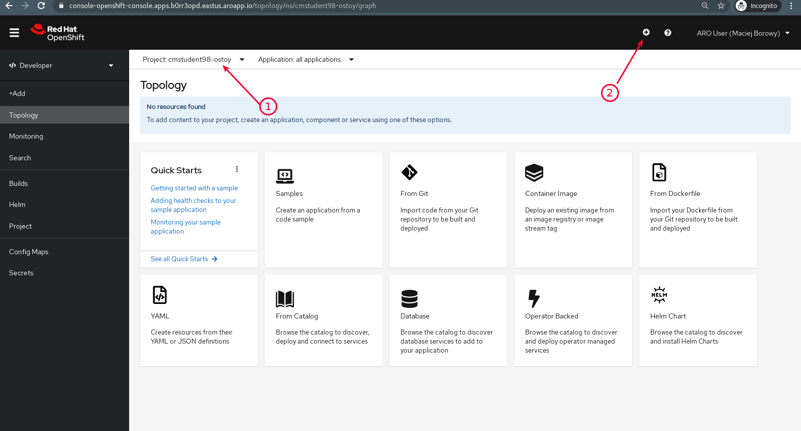
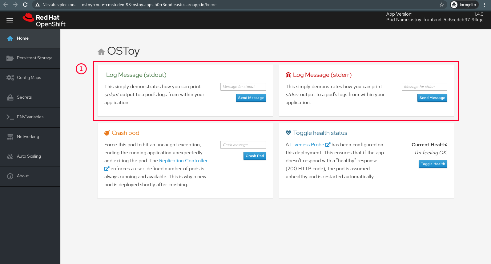
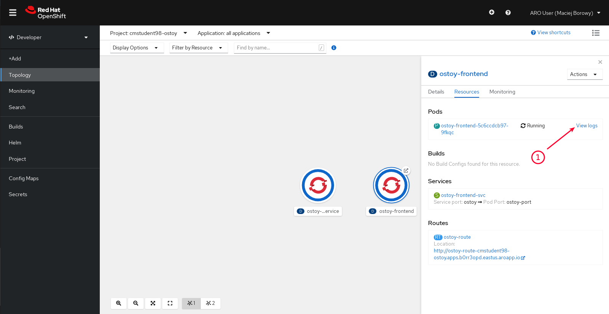

<br><br>
<br><br>
<br><br>

# OpenShift Labs

## LAB Overview

W tym ćwiczeniu wdrożysz testowy projekt ["OSToy"](https://github.com/openshift-cs/ostoy) (stworzony przez [OpenShift Customer Success](https://github.com/openshift-cs)) i zobaczysz jak działa funkcja przeglądania logów aplikacji (stdout i stderr) w OpenShift.

## 1. Utwórz nowy projekt

1. Przejdź do perspektywy programisty
1. Rozwiń listę projektów
1. Dodaj nowy projekt "Create project"
1. Nazwij projekt w formacie `<login_konta_aad>-ostoy`, gdzie w `<login_konta_aad>` wstawisz login użytkownika z konta AAD, np. dla `cmstudent99@chmurowiskolab.onmicrosoft.com` wstaw `cmstudent99`.

## 2. Wykonaj deployment

### 2.1. Wykonaj deployment narzędziem `oc`

**Uwaga**: Wykonaj poniższe kroki tylko jeśli posiadasz narzędzie `oc` zainstalowane na swoim komputerze. W przeciwnym razie przejdź do punktu 2.2.

1. Wykonaj poniższą komendę by wylistować posiadane projekty

   ```shell
   oc get projects
   ```

1. Wykonaj poniższą komendę by zmienić projekt:

   ```shell
   oc project <login_konta_aad>-ostoy
   ```

1. Wyświetl plik [`files/backend.yaml`](./files/backend.yaml), skopiuj jego zawartość. Stwórz plik o nazwie `backend.yaml` w wybranym folderze (np. `C:/openshift` (Windows) lub `~/openshift` (Linux)) i wklej tam skopiowaną zawartość.
1. Przejdź do nowego folderu stworzonego w poprzednim kroku i z linii poleceń wykonaj komendę:

   ```shell
   oc apply -f backend.yaml
   ```

   W efekcie otrzymasz output (lub podobny):

   ```shell
   $ oc apply -f backend.yaml
   deployment.apps/ostoy-microservice created
   ```

1. Wyświetl plik [`files/frontend.yaml`](./files/frontend.yaml), skopiuj jego zawartość. Stwórz plik o nazwie `frontend.yaml` w wybranym folderze (np. `C:/openshift` (Windows) lub `~/openshift` (Linux)) i wklej tam skopiowaną zawartość.
1. Wykonaj komendę:

   ```shell
   oc apply -f frontend.yaml
   ```

   W efekcie otrzymasz output (lub podobny):

   ```shell
   $ oc apply -f frontend.yaml
   persistentvolumeclaim/ostoy-pvc created
   deployment.apps/ostoy-frontend created
   service/ostoy-frontend-svc created
   route.route.openshift.io/ostoy-route created
   secret/ostoy-secret-env created
   configmap/ostoy-configmap-files created
   secret/ostoy-secret created
   ```

### 2.2. Wykonaj deployment ręcznie przez Web Console

**Uwaga**: Wykonaj poniższe kroki tylko jeśli nie wykonałeś deploymentu narzędziem `oc`

1. Wyświetl plik [`files/backend.yaml`](./files/backend.yaml)
1. Skopiuj pierwszą część pliku [`files/backend.yaml`](./files/backend.yaml) (każda część oddzielana jest separatorem `---`).

   ```yaml
   ---
   apiVersion: v1
   kind: Route
   metadata:
     name: ostoy-route
   spec:
     to:
       kind: Service
       name: ostoy-frontend-svc
   ---
   apiVersion: v1
   kind: Secret
   metadata:
     name: ostoy-secret-env
   type: Opaque
   data:
     ENV_TOY_SECRET: VGhpcyBpcyBhIHRlc3Q=
   ---

   ```

   Dla powyższego przykładu są dwie sekcje:

   ```yaml
   apiVersion: v1
   kind: Route
   metadata:
     name: ostoy-route
   spec:
     to:
       kind: Service
       name: ostoy-frontend-svc
   ```

   oraz

   ```yaml
   apiVersion: v1
   kind: Secret
   metadata:
     name: ostoy-secret-env
   type: Opaque
   data:
     ENV_TOY_SECRET: VGhpcyBpcyBhIHRlc3Q=
   ```

1. Przejdź do strony OpenShift i upewnij się że znajdujesz się w dobrym projekcie. Kliknij w przycisk "Add YAML"

   

1. Dodaj do projektu każdy skopiowany fragment (uważaj na poprawną identację pliku YAML)

   

## 3. Wyświetl stronę aplikacji

1. Przejdź do perspektywy _Developera_
1. Przejdź do widoku _Topology_. Sprawdź czy wygląda jak na zrzucie poniżej:

   

1. Wyświetl aplikację. Upewnij się, że wygląda jak na zrzucie poniżej.

   

## 4. Wypróbuj funkcję logowania

1. Wpisz w obu okienkach wiadomość, którą chcesz zobaczyć w logach aplikacji np. `Hello, World!` oraz `Hello, Error!`. Po wpisaniu wiadomości wciśnij przycisk "Send Message".

   

1. Wróć do OpenShift i Topology View. Kliknij w pod o nazwie `ostoy-frontend` i wyświetl jego szczegóły. Znajdź sekcję _"Pods"_. Kliknij _"View logs"_ i wyświetl logi dla Pod.

   

1. Sprawdź czy w logach widzisz informacje:

   ```
   stdout: Hello, World!
   stderr: Hello, Error!
   ```

## END LAB

<br><br>

<center><p>&copy; 2021 Chmurowisko Sp. z o.o.<p></center>
