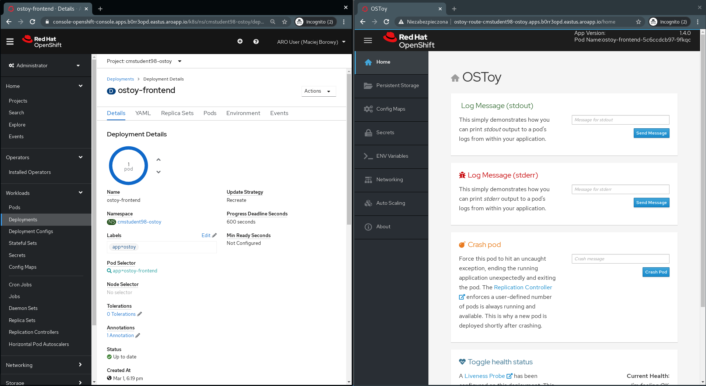
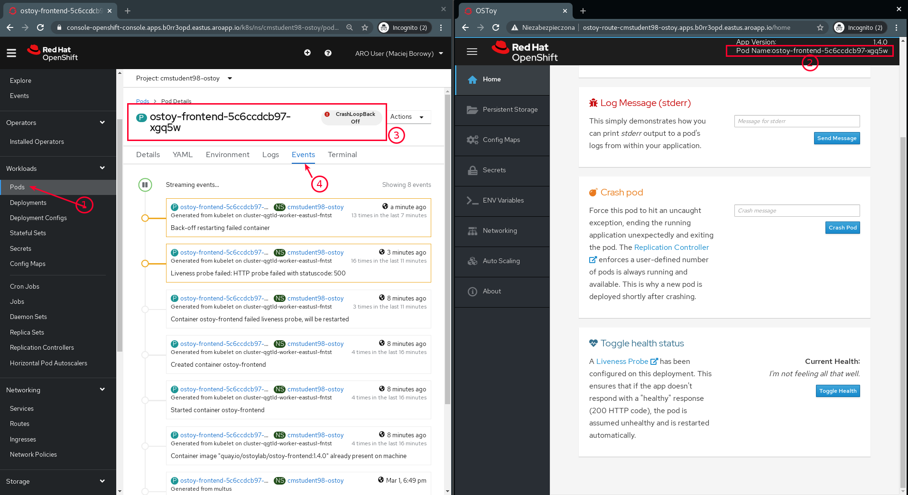
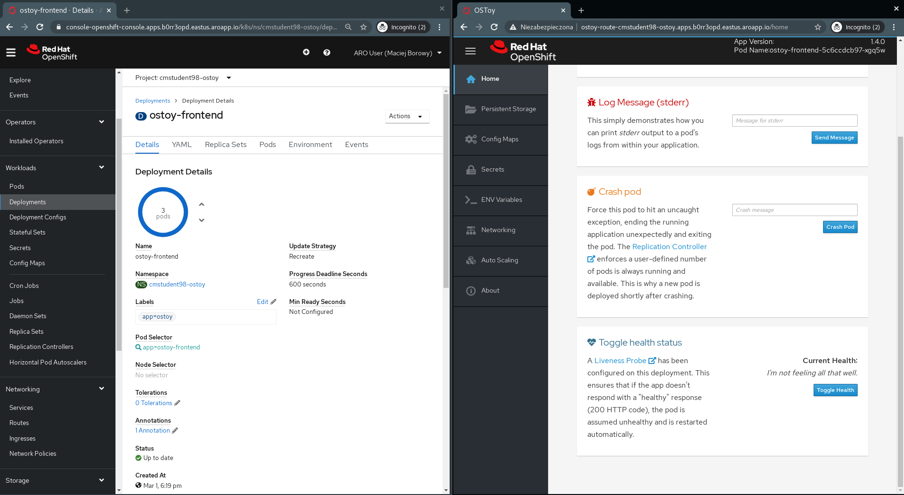

  
  
  

# OpenShift Labs

## LAB Overview

W tym ćwiczeniu wdrożysz testowy projekt ["OSToy"](https://github.com/openshift-cs/ostoy) (stworzony przez [OpenShift Customer Success](https://github.com/openshift-cs)) i zobaczysz w jaki sposób OpenShift reaguje na awarie Podów.

## Wymagania

1. Ukończenie lab `02-view-pod-logging`.

## 1. Sprawdź w jaki sposób OpenShift reaguje na awarie Pod

1. Otwórz okno przeglądarki z OpenShift obok okna przeglądarki z widokiem aplikacji. Reakcja OpenShift na awarię aplikacji będzie bardzo szybka - otwierając oba okna obok siebie na pewno ją zauważymy :)

   

1. W OpenShift wybierz perspektywę Administratora, przejdź do _Deployments_ i wyświetl Deployment dla `ostoy-frontend`.
1. W aplikacji OSToy skorzystaj z opcji _"Crash Pod"_. Podaj dowolną wiadomość i kliknij przycisk _"Crash Pod"_. **Obserwuj okno przeglądarki z OpenShift, żeby zobaczyć jak zareaguje OpenShift**.

   

1. Powtórz operację klikukrotnie (np. 3-4 razy) i zobacz jak zachowuje się OpenShift.

## 2. Sprawdź w jaki sposób zdefiniowany został Liveness Probe

1. Sprawdź w jaki sposób zdefiniowany jest w YAML z lab 02
1. Sprawdź w jaki sposób zdefiniowany jest w YAML w OpenShift

## 3. Sprawdź w jaki sposób OpenShift zareaguje na brak odpowiedzi na Liveness Probe

1. Otwórz okno przeglądarki z OpenShift obok okna przeglądarki z widokiem aplikacji.
1. W OpenShift wybierz perspektywę Administratora, przejdź do _Deployments_ i wyświetl Deployment dla `ostoy-frontend`.
1. Zwiększ liczbę replik do 3.

   

1. W aplikacji OSToy skorzystaj z opcji _"Toggle health status"_. Podaj dowolną wiadomość i kliknij przycisk _"Toggle Health"_. **Obserwuj okno przeglądarki z OpenShift, żeby zobaczyć jak zareaguje OpenShift**. Może zająć to 1-2 minuty. Jeśli Pod nie zginął w sposób widoczny odśwież stronę i wykonaj klikukrotnie tę operację.

   

1. Przejdź do listy podów (1). Na liście wyszukaj pod, którego nazwa (3) pasuje do tej wyświetlanej w aplikacji (2). Po przejściu do szczegółów Pod, przejdź do zakładki Events (4).

   

1. Poczekaj 1-3 minuty i sprawdź czy Pod z awarią został zastąpiony.

   

## END LAB

  

&copy; 2021 Chmurowisko Sp. z o.o.

