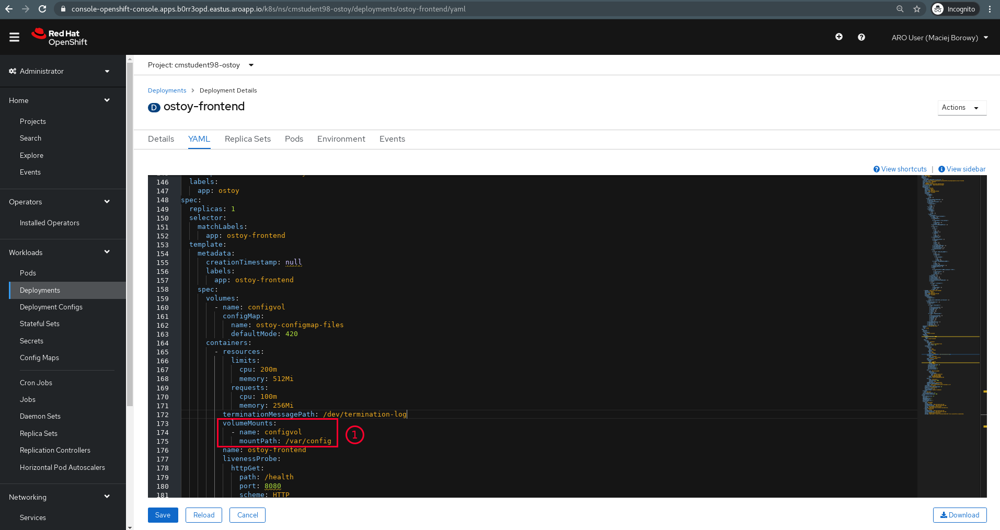

<br><br>
<br><br>
<br><br>

# OpenShift Labs

## LAB Overview

W tym ćwiczeniu wdrożysz testowy projekt ["OSToy"](https://github.com/openshift-cs/ostoy) (stworzony przez [OpenShift Customer Success](https://github.com/openshift-cs)) i zobaczysz w jaki sposób OpenShift używa _Config Maps_, _Secrets_ oraz zmiennych środowiskowych.

## Wymagania

1. Ukończenie lab `02-view-pod-logging`

## 1. Dodaj ConfigMap

1. Przejdź do perspektywy Developera
1. Przejdź do Config Maps. Kliknij _"Create Config Map"_.
1. Zastąp wyświetlony plik YAML poniższą treścią:

   ```yaml
   kind: ConfigMap
   apiVersion: v1
   metadata:
     name: ostoy-configmap-files
   data:
     config.json: '{ "default": "123" }'
   ```

## 2. Dodaj ConfigMap do Deployment `ostoy-frontend`

1. Przejdź do perspektywy Administratora
1. Przejdź do Deployment _"ostoy-frontend"_
1. Rozwiń drop-down _"Actions"_ i wybierz _"Edit Deployment"_
1. W wyświetlonym YAML zlokalizuj kod jak na poniższym zrzucie (lub zlokalizuj sekcję `volumes`):

   

1. Dodaj poniższy kod jak na zrzucie poniżej (lub uzupełnij istniejącą sekcję `volumes`):

   ```yaml
   volumes:
     - name: configvol
       configMap:
         name: ostoy-configmap-files
         defaultMode: 420
   ```

   

1. Dodaj poniższy kod jak na zrzucie poniżej (lub uzupełnij istniejącą sekcję `volumeMounts`):

   ```yaml
   volumeMounts:
     - name: configvol
       mountPath: /var/config
   ```

   

## 3. Utwórz na nowo Pod dla Deployment `ostoy-frontend`

> W tym kroku chcemy odświeżyć konfigurację Persistent Volumes podłączonych do Pod. W tym celu likwiduje go i tworzę na nowo.

1. Zmniejsz liczbę replik do 0
1. Zwiększ liczbę replik do 1

## 4. Wyświetl ConfigMap w UI aplikacji `ostoy-frontend`

1. Sprawdź czy w UI aplikacji `ostoy-frontend` można wyświetlić Config Map
1. Sprawdź czy Config Map zawiera treść z kroku 1

   ```json
   { "default": "123" }
   ```

## END LAB

<br><br>

<center><p>&copy; 2021 Chmurowisko Sp. z o.o.<p></center>
